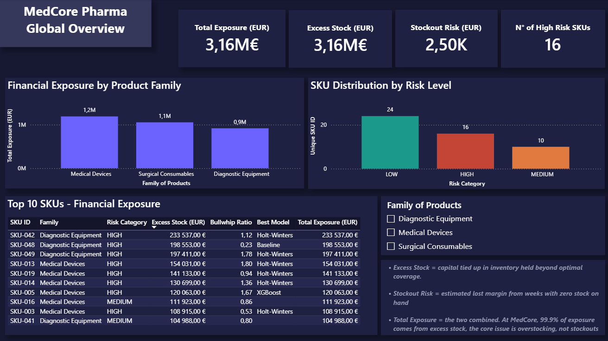
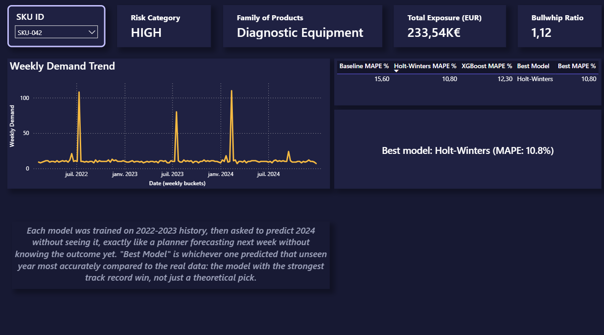
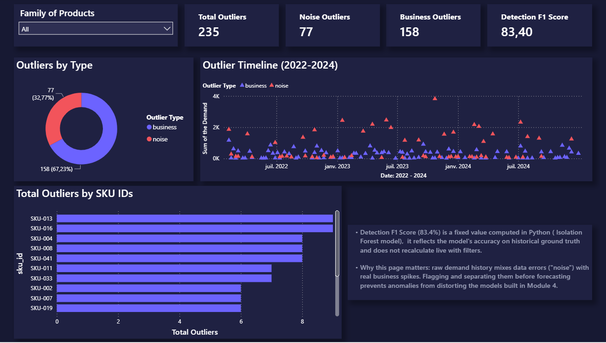
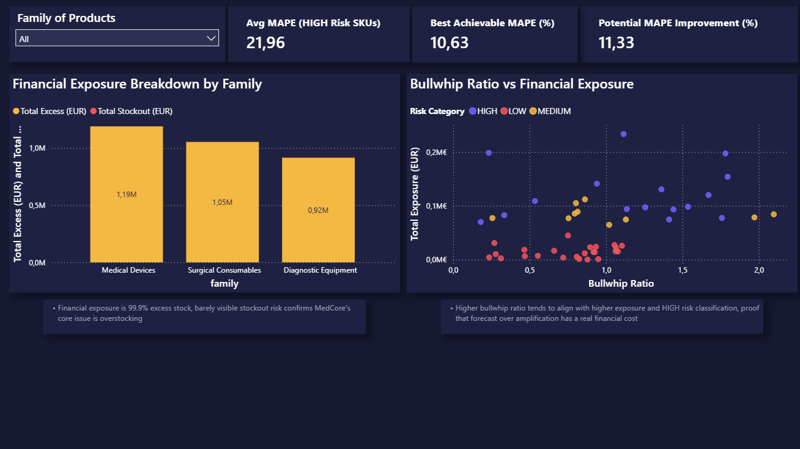

# MedCore Pharma — Demand Planning Intelligence

An end-to-end demand planning analytics project simulating a pharma/medical device distributor: synthetic but realistic data generation, forecast error analysis, anomaly detection, model benchmarking, bullwhip effect quantification, financial impact modeling, and an interactive Power BI dashboard.

Built as a portfolio project to demonstrate applied Python, statistics, and BI skills in a realistic S&OP context, not a generic ML exercise, but a pipeline mirroring how a demand planning team would actually diagnose and prioritize forecasting issues across a product portfolio.

## Business context

MedCore Pharma (fictional) distributes medical devices, surgical consumables, and diagnostic equipment across 3 markets. Like most mid-size distributors, its forecasting relies on a mix of sales input and a basic algorithm, with no systematic way to know:

- Which SKUs are actually poorly forecast, and how much that costs
- Whether "unusual" demand weeks are data errors or real business events
- Which forecasting model works best and for whom
- Whether demand signals are being amplified as they move upstream (bullwhip effect)

This project builds that visibility from scratch.

## Key results

Metric & Result 

Total financial exposure identified : €3.16M
Share of exposure from excess stock (vs. stockout) : 99.9% 
Outlier detection accuracy (Isolation Forest) : F1 = 83.4% 
Best baseline forecast error (MAPE) : 12.1%
SKUs where Holt-Winters outperforms despite worst average MAPE : 9 out of 16
Bullwhip ratio (forecast vs. demand variance) : 0.94 avg, directionally confirmed on flagged SKUs

Headline insight: no single forecasting model wins across the portfolio, the model with the worst average error is still the single most frequent per-SKU winner. This is the core argument for a best-fit, per-SKU model selection strategy, rather than a one-size-fits-all approach. That is reflected directly in the PowerBI dashboard.

## Project structure

The project is organized as 7 sequential modules, each a standalone notebook building on the SQLite database populated by the previous ones.

Module | Notebook | What it does 

M1 - '01_data_generation.ipynb': Generates 50 SKUs × 3 markets × 152 weeks of synthetic demand, with configurable bias, seasonality, and bullwhip flags baked in as ground truth
M2 - '02_forecast_error_analysis.ipynb': Computes MAPE/bias per SKU, risk-scores the portfolio, quantifies excess stock exposure
M3 - '03_outlier_detection.ipynb': Isolation Forest model to separate data noise from real business spikes (F1 = 83.4%)
M4 - '04_forecast_models.ipynb' : Benchmarks Baseline (moving average), Holt-Winters, and XGBoost on HIGH-risk SKUs
M5 - '05_bullwhip_effect_quantification.ipynb': Quantifies demand amplification via variance ratio; includes a multi-period robustness check that was tested, found statistically unreliable, and documented as a methodology limitation rather than silently discarded
M6 - '06_financial_impact.ipynb': Consolidates M2–M5 into a single financial exposure view, by SKU and by product family
M7 - Power BI dashboard: 4-view interactive dashboard connecting all of the above

Each notebook writes its outputs to a shared SQLite database (`data/medcore.db`), so downstream modules always work from the latest validated results rather than recomputing from scratch.

## Dashboard

Built in Power BI.

1. Global Overview - portfolio-level KPIs, exposure by family, risk distribution, top 10 SKUs by financial exposure

2. SKU Drill-Down - select any SKU to see its demand trend, model comparison, and financial context in one view

3. Outliers - detection breakdown by type (noise vs. business), timeline view, top SKUs by anomaly count

4. Financial Dashboard - exposure breakdown, bullwhip ratio vs. financial exposure relationship, potential MAPE improvement from adopting best-fit models

## Methodology notes

- Backtesting, not fitting: forecast models in M4 are trained on 2022–2023 and evaluated on unseen 2024 data, model selection reflects real predictive performance, not in-sample fit.

- Statistical honesty over a cleaner story: the bullwhip multi-period robustness check (M5) revealed that splitting an already-short history into yearly sub-periods destroys statistical power and can invert a real signal. Rather than hide this, the notebook documents it as a known limitation and reverts to the full-window metric. It was a deliberate choice to show my thinking path throughout this analysis.

- Two-tier outlier logic: synthetic "noise" outliers (×5–10 demand spikes, data errors) are distinguished from "business" outliers (×1.8–2.5, plausible real events). The detection pipeline flags both, but they warrant different downstream treatment.

- No single model wins: M4's central finding, the worst-average model is the most frequent per-SKU winner. That is the reason my analysis argues for per-SKU model selection instead of a portfolio-wide standard.

## Tech stack

- Python 3.13 (pandas, numpy, scikit-learn, statsmodels, xgboost, matplotlib)
- SQLite as the shared data layer across modules
- Power BI Desktop for the interactive dashboard

## Repository structure

pharma-demand-planning/
├── data/                   # SQLite database
├── notebooks/              # M1–M6 notebooks
├── outputs/                # Exported charts + CSVs for Power BI
│   └── powerbi/            # CSV exports feeding the dashboard
├── powerbi/                # .pbix file
└── README.md

## About

Built by Aboubacar Diaby - S&OP Manager & Supply Chain Specialist.

[LinkedIn](https://www.linkedin.com/in/aboubacar-diaby-3b3a1b180/)
